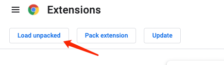
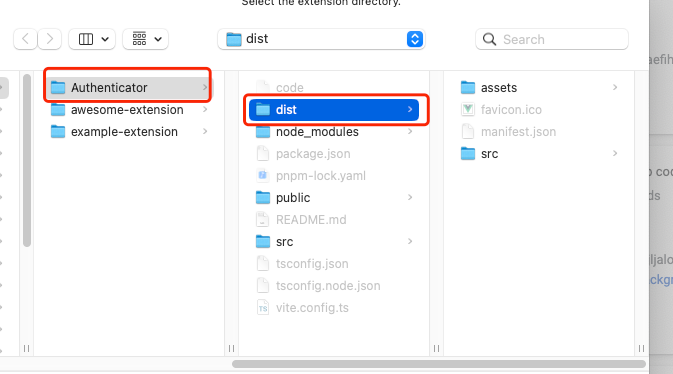

# Authenticator

> 运行在 Chrome 插件平台的 Authenticator。

## Usage

### 1. 打包
```shell
npm run build
```

### 2. 打开 Chrome 的插件列表界面
[chrome://extensions/](chrome://extensions/)

开启右上角的 **开发者模式**

### 3. 加载插件


插件位于项目下的`dist`目录：


## License
MIT
